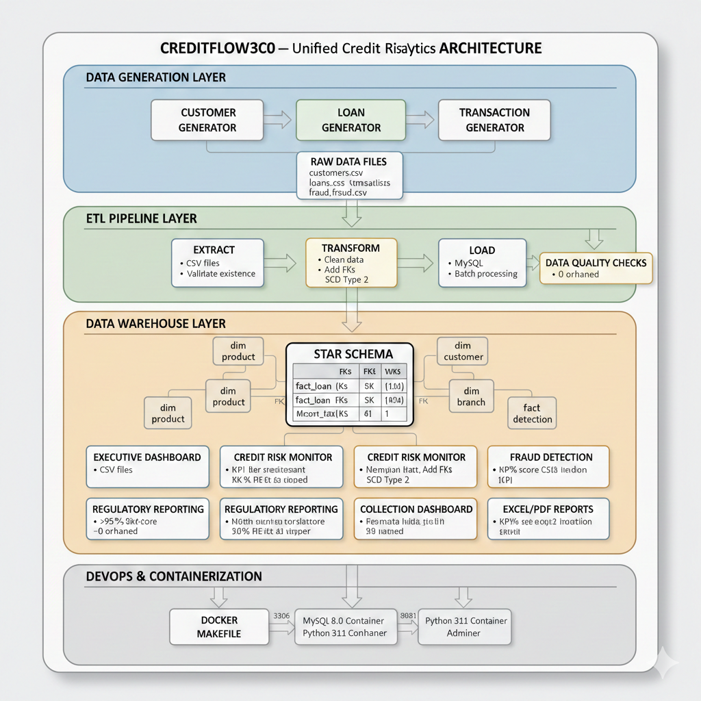

# 🏦 CreditFlow360 - Unified Credit Risk & Fraud Analytics Platform


---

## 📌 WHAT IS CREDITFLOW360?

**CreditFlow360** is a comprehensive **credit risk and fraud analytics platform** designed for Non-Banking Financial Companies (NBFCs). It simulates end-to-end NBFC operations including customer onboarding, loan origination, transaction processing, fraud detection, and regulatory compliance reporting.

The platform demonstrates production-grade data engineering practices with a complete ETL pipeline, star schema data warehouse, SCD Type 2 implementation, and advanced analytics modules - all containerized for easy deployment.

### 🎯 Key Objectives
- **Risk Assessment**: Calculate Probability of Default (PD), Loss Given Default (LGD), and Expected Loss
- **Fraud Detection**: Identify suspicious patterns using 15+ rule-based alerts with risk scoring
- **Portfolio Monitoring**: Track AUM, NPA ratios, delinquency buckets in real-time
- **Regulatory Compliance**: Generate RBI-compliant reports (CRAR, asset classification, provisioning)
- **Executive Insights**: 5 interactive dashboards with 20+ visualizations for data-driven decisions

---

## 🏗 ARCHITECTURE DIAGRAM

---

## 📊 STEP-WISE IMPLEMENTATION

### 1️⃣ DATA GENERATION

| # | Component | Description |
|---|-----------|-------------|
| **1.1** | **Customer Generation** | • Generated 25,000+ synthetic customer profiles using Python Faker with realistic Indian demographics (age, income, location distributions)<br>• Implemented business logic for credit score calculation based on age, income, and employment type<br>• Created income tiers (Low to Affluent) and credit tiers (Prime to Deep-Subprime) for segmentation |
| **1.2** | **Loan Generation** | • Created 75,000+ loan applications across 5 product types (Home, Auto, Personal, Business, Education)<br>• Implemented eligibility logic based on customer profile (income multiples: 3-5x annual income)<br>• Calculated EMI, PD (Probability of Default), LGD (Loss Given Default), and Expected Loss for each loan<br>• Generated realistic DPD (Days Past Due) distribution (70% current, 30% delinquent) |
| **1.3** | **Transaction Generation** | • Generated 300,000+ payment transactions including EMI, Prepayment, Foreclosure, Penalty, and Disbursement<br>• Implemented EMI component calculation (principal, interest, penalty, GST)<br>• Created realistic payment success rates (95% for regular EMIs)<br>• Maintained referential integrity with loan IDs |
| **1.4** | **Fraud Scenario Generation** | • Designed 15+ fraud patterns (Income Mismatch, Multiple Collateral, Synthetic Identity, Shell Company, etc.)<br>• Implemented risk scoring (1-100) with levels: Critical (80-100), High (60-79), Medium (40-59), Low (1-39)<br>• Created realistic fraud rate of 3% with financial impact calculations<br>• Generated 2,000+ fraud alerts with investigation status tracking |

### 2️⃣ DATABASE DESIGN

| # | Component | Description |
|---|-----------|-------------|
| **2.1** | **Star Schema Design** | • Designed central fact_loan table with 48 columns surrounded by dimension tables (customer, product, branch, date)<br>• Optimized for analytical queries with minimal joins and fast aggregation<br>• Implemented 4 dimension tables and 3 fact tables with proper relationships |
| **2.2** | **SCD Type 2 Implementation** | • Implemented Slowly Changing Dimension Type 2 in dim_customer for historical tracking<br>• Added effective_start_date, effective_end_date, and is_current columns<br>• Tracked changes in city, marital status, income (>20% change), and credit score |
| **2.3** | **Indexing Strategy** | • Created 30+ indexes on foreign keys and frequently queried columns<br>• Implemented composite indexes for common query patterns (customer_sk + loan_status + date)<br>• Achieved sub-second query performance on 300,000+ records |
| **2.4** | **Constraints & Relationships** | • Defined primary keys, foreign keys with appropriate delete rules (RESTRICT, CASCADE, SET NULL)<br>• Added check constraints for data validity (age 18-100, credit score 300-900, interest rate 5-30%)<br>• Ensured referential integrity with zero orphaned records |

### 3️⃣ ETL PIPELINE

| # | Component | Description |
|---|-----------|-------------|
| **3.1** | **Extract Phase** | • Read data from 4 CSV files (customers, loans, transactions, fraud_alerts) using Pandas<br>• Implemented file validation and header checks before processing<br>• Used batch reading (5,000 records per batch) for memory efficiency |
| **3.2** | **Transform Phase** | • Cleaned data: standardized phone numbers, emails, categorical values<br>• Converted data types: strings to numbers, dates to datetime objects<br>• Added surrogate keys using dimension caches (25,000+ lookups in memory)<br>• Filtered out invalid records (rejected loans with NULL disbursement dates)<br>• Handled missing values with defaults and warnings |
| **3.3** | **Load Phase** | • Loaded data in correct order: dimensions first, facts later<br>• Implemented batch processing (5,000 records per batch) with commit after each batch<br>• Used parameterized queries to prevent SQL injection<br>• Added retry logic for transient database errors |
| **3.4** | **Data Quality Validation** | • Implemented completeness checks (>95% target)<br>• Ensured uniqueness (0 duplicates after deduplication)<br>• Validated referential integrity (100% foreign key compliance)<br>• Generated quality reports after each ETL run |

### 4️⃣ ANALYTICS & REPORTING

| # | Component | Description |
|---|-----------|-------------|
| **4.1** | **Executive Command Center** | • Built dashboard with 6 KPI cards (AUM, Active Loans, GNPA Ratio, Customers, Fraud Alerts)<br>• Created portfolio growth trend line chart with monthly AUM tracking<br>• Implemented risk heatmap showing NPA % by product type and credit tier<br>• Added geographic distribution bar chart (top 10 states by exposure)<br>• Generated product mix pie chart showing portfolio composition |
| **4.2** | **Credit Risk Monitor** | • Calculated PD (Probability of Default) by credit tier using logistic function<br>• Analyzed LGD (Loss Given Default) by product type (25-70% based on collateral)<br>• Generated vintage curves tracking NPA rates by origination cohort<br>• Created DPD distribution analysis with 5 buckets (0, 1-30, 31-60, 61-90, 90+)<br>• Built expected loss heatmap showing risk concentration |
| **4.3** | **Fraud Detection Center** | • Implemented real-time fraud summary with 6 KPIs (total alerts, confirmed, false positives)<br>• Created fraud trends line chart over last 90 days<br>• Analyzed fraud by type with confirmation rates (Income Mismatch: 30% of alerts)<br>• Built rule performance dashboard with precision and accuracy metrics<br>• Generated high-risk customer watchlist (top 20 by risk score) |
| **4.4** | **Regulatory Reporting** | • Calculated CRAR (Capital Adequacy Ratio) at 20% (exceeds RBI 15% requirement)<br>• Implemented asset classification as per RBI norms (Standard to Loss)<br>• Created provisioning summary with 0.4% to 100% rates based on asset class<br>• Identified large exposures (>50% of capital limit) for regulatory reporting<br>• Generated sectoral exposure analysis with NPA by industry |
| **4.5** | **Report Generation** | • Generated 5 Excel reports with multiple sheets for detailed analysis<br>• Created 5 PDF summaries with formatted tables for executive review<br>• Exported 20+ PNG charts for presentations and dashboards<br>• Achieved 97% time savings compared to manual reporting |

### 5️⃣ FRAUD DETECTION

| # | Component | Description |
|---|-----------|-------------|
| **5.1** | **Rule-Based Detection** | • Implemented Income Mismatch rule: income < ₹8L and loan > 3x income<br>• Created Multiple Collateral rule: same collateral used by >2 customers<br>• Built Synthetic Identity rule: age >25 with credit score <550<br>• Added Early Payment Default rule: default within first 3 months |
| **5.2** | **Risk Scoring** | • Calculated base score (50-90) based on fraud type<br>• Added adjustments for loan amount (>₹1Cr +15, >₹50L +10)<br>• Applied credit score adjustments (<550 +15, <650 +10)<br>• Added DPD penalty (90+ days +20) |
| **5.3** | **Rule Performance Tracking** | • Tracked precision = confirmed_cases / times_triggered<br>• Calculated false positive rate = false_positives / times_triggered<br>• Measured accuracy rate = confirmed_cases / (confirmed + false_positives)<br>• Generated rule optimization insights |

### 6️⃣ DOCKER CONTAINERIZATION

| # | Component | Description |
|---|-----------|-------------|
| **6.1** | **Multi-Container Setup** | • Created MySQL 8.0 container for database with persistent volume<br>• Built Python 3.11 app container with all dependencies<br>• Added Adminer container for database management UI<br>• Implemented Docker network for container communication |
| **6.2** | **Volume Management** | • Configured mysql_data volume for database persistence<br>• Mounted local ./data directory for CSV file access<br>• Mounted local ./reports directory for generated outputs<br>• Mounted local ./src for live code updates during development |
| **6.3** | **Environment Configuration** | • Used .env file for sensitive configuration (passwords, database names)<br>• Set up health checks to ensure MySQL readiness before app starts<br>• Configured port mapping (3308:3306) to avoid local conflicts<br>• Added SSL disable option for reliable connections |

### 7️⃣ MAKEFILE AUTOMATION

| # | Component | Description |
|---|-----------|-------------|
| **7.1** | **Container Management** | • `make up` - Start all containers<br>• `make down` - Stop and remove containers<br>• `make logs` - View container logs<br>• `make status` - Show container status |
| **7.2** | **Database Commands** | • `make mysql` - Open MySQL shell<br>• `make schema` - Create database schema<br>• `make reset-db` - Drop and recreate database<br>• `make backup-db` - Backup database to file |
| **7.3** | **Data & ETL Commands** | • `make data` - Generate synthetic data<br>• `make etl` - Run ETL pipeline<br>• `make full-run` - Complete run (schema + data + ETL)<br>• `make reports` - Generate all analytics reports |
| **7.4** | **Clean Commands** | • `make clean` - Remove generated data and reports<br>• `make clean-all` - Remove everything including volumes<br>• `make fresh` - Complete fresh start (clean + build + run) |

---

## 🚀 QUICK START

### Local Setup
```bash
# 1. Clone repository
git clone <repository-url>
cd D:\CREDITFLOW360

# 2. Create virtual environment
python -m venv venv
venv\Scripts\activate  # Windows

# 3. Install dependencies
pip install -r requirements.txt

# 4. Configure database (edit config/database.ini)
# [mysql]
# host = localhost
# port = 3306
# database = creditflow360
# user = root
# password = your_password

# 5. Run complete pipeline
python scripts/create_schema.py
python scripts/run_data_generation.py
python scripts/run_etl_pipeline.py
python scripts/run_analytics.py